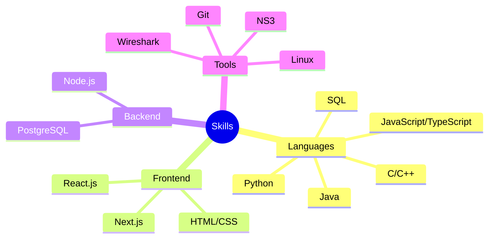

<div align="center">
  

  # Giovanni Battista Pernazza
  ### Software Engineer 

  [](https://your-website-url.com)
  [](https://linkedin.com/in/your-profile)
  [](https://github.com/nannipy)
  [](mailto:gb.pernazza@gmail.com)
</div>

## 👨‍💻 About Me

```typescript
const giovanni = {
    location: "Rome, Italy",
    education: "Computer Engineering @ La Sapienza",
    currentRole: "Lead Web Developer @ Sapienza Foiling Team",
    interests: ["Web Development", "System Design", "Network Engineering"],
    languages: {
        programming: ["TypeScript", "Python", "C++", "Java"],
        human: ["Italian", "English", "French"]
    }
};
```

## 🛠️ Technical Skills




## 📫 Get in Touch

- 📧 Email: gb.pernazza@gmail.com
- 📱 Phone: +39 3341287766
- 🌍 Location: Rome, Italy

<div align="center">

### Languages and Tools


---

<i>Let's connect and build something amazing together!</i>

</div>
