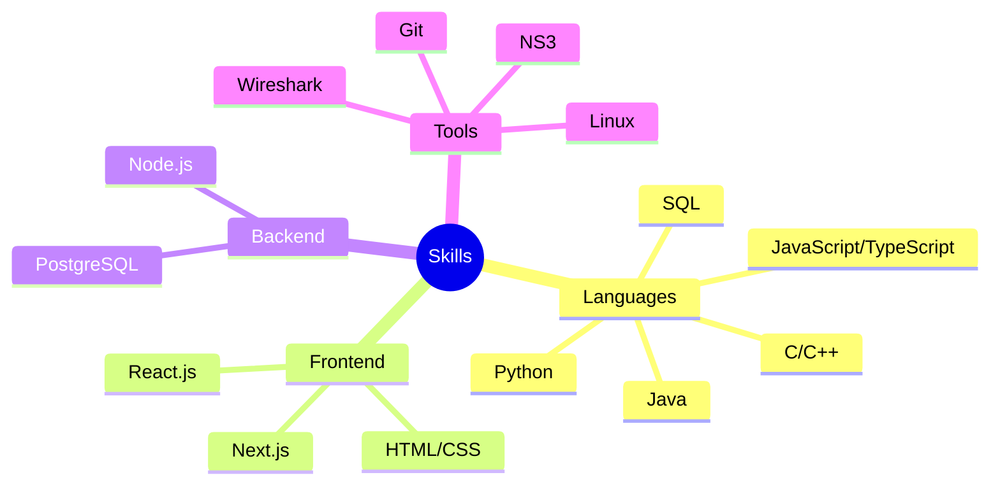

<div align="center">
  

  # Giovanni Battista Pernazza
  ### Full Stack Developer | Computer Engineer

  [](https://your-website-url.com)
  [](https://linkedin.com/in/your-profile)
  [](https://github.com/nannipy)
  [](mailto:gb.pernazza@gmail.com)
</div>

## 👨‍💻 About Me

```typescript
const giovanni = {
    location: "Rome, Italy",
    education: "Computer Engineering @ La Sapienza",
    currentRole: "Lead Web Developer @ Sapienza Foiling Team",
    interests: ["Web Development", "System Design", "Network Engineering"],
    languages: {
        programming: ["TypeScript", "Python", "C++", "Java"],
        human: ["Italian", "English", "French"]
    }
};
```

## 🚀 Featured Projects

<details>
<summary><b>🌾 Agricola Pernazza</b></summary>

A modern web application for a family-owned farm in Amelia, Italy.
- **Tech Stack:** React.js, Next.js
- **Features:** Product ordering, Event management, Farm information
- [View Project](https://github.com/nannipy/agricola-pernazza)
</details>

<details>
<summary><b>🌿 Parco La Cascina</b></summary>

E-commerce platform for an agricultural business in Varese.
- **Tech Stack:** React.js, Tailwind CSS, EmailJS
- **Features:** Product showcase, Online ordering, Contact system
- [View Project](https://github.com/nannipy/parcolacascina)
</details>

<details>
<summary><b>💻 Divide by Zero</b></summary>

Community platform for tech enthusiasts.
- **Tech Stack:** HTML, CSS, JavaScript, PHP, MySQL
- **Features:** User authentication, Public/Private sections
- [View Project](https://github.com/nannipy/divide-by-zero)
</details>

## 🛠️ Technical Skills



## 📈 GitHub Stats

<div align="center">
  
  
</div>

## 🎓 Education & Experience

- **Computer Engineering** @ Università La Sapienza (2020)
- **Lead Web Developer** @ Sapienza Foiling Team
  - Leading web projects with Agile methodology
  - Implementing CI/CD pipelines
  - Performance optimization and testing

## 🌟 Achievements

- Phillips Exeter Academy Summer Program
- [Add other notable achievements]

## 📫 Get in Touch

- 📧 Email: gb.pernazza@gmail.com
- 📱 Phone: +39 3341287766
- 🌍 Location: Rome, Italy

<div align="center">

### Languages and Tools


---

<i>Let's connect and build something amazing together!</i>

</div>
